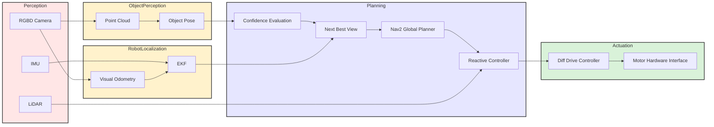

# Active Perception for Accurate Object Localization and Navigation
The goal of this project is to develop an autonomous mobile robot system capable of accurately localizing a target object using RGB-D perception and actively improving this estimate through motion. The TurtleBot4 will estimate the target object's ground-plane pose relative to the robot and compute a confidence metric representing the reliability of the estimate.

Using an active perception loop, the system will determine the next-best viewpoint that is expected to reduce pose uncertainty. The robot will autonomously navigate to these viewpoints while avoiding obstacles using the ROS2 Nav2 navigation stack or a reactive controller till a desired confidence threshold is achieved.

# Robot Platform
- **Platform:** TurtleBot 4.
- **Base:** Differential drive.
- **Onboard sensors:** RGB-D camera, LiDAR, IMU.

# High-Level System Architecture

# Git Infrastructure
- **GitHub Page:** https://seasonedleo.github.io/RAS_Mobile_Robotics_Vision/

